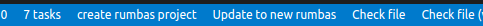

# Getting Started

This Getting Started Guide will learn you 
* how to setup your own rumbas repo on Github, with a complete development environment using Github Codespaces
* to write and run your first question
* to write and run your first exam (TODO?)
* to get familiar with possible next steps to make more advanced use of rumbas (TODO).

It assumes a minimal familiarity with VSCode.

## Create an empty rumbas repository

While you can use rumbas locally on your PC,
the quickest way to get started is to use a Github Codespace from a template:

```admonish question title="Task"

- Create a free Github account if you don't have one yet.

- Click on [](https://github.com/codespaces/new?machine=basicLinux32gb&repo=590531795&ref=main&devcontainer_path=.devcontainer%2Fdevcontainer.json&location=WestEurope) and accept all settings and clich the green 'Create codespace' button. Don't panic on the 'Codespace usage for this repository is paid for by <you>' message: basic usage is free, and you'll be warning if charges would apply after using your 
codespace for hours...

- You now have a VSCode interface in your browser with a mostly empty folder, but with the most recent rumbas version installed and ready to go.
    - Open a terminal, and run `rumbas --version` to check if the setup is working.

```

Note that you won't be able to easily save your work. If you've decided to make more serious use of rumbas, consider creating your own repo, and/or run rumbas locally on your PC with Docker:

- Go to https://github.com/m8rex/rumbas-codespaces-template, and click on the green 'Use this template' button to create your personal rumbas-repository by choosing the 'Create a new repository' option.
  - Place it under your personal account 
  - Choose a name 
  - Decide whether it should be a private or public repo.
  - You'll be sent to your new repo.

- In your newly created repo, click on the green 'Code' button, use the 'Codespaces' tab and click on the green 'Create codespace on main' button (or on the plus icon if you've already used Codespaces before...).

More information and different options to use rumbas can be found in [the installation guide](./installation.html#running-the-last-released-version) 

## Initialise you new rumbas project

```admonish question title="Task"

Run the command `rumbas init` to initialise the a rumbas project.

You can either do this in a Terminal, or click on the `Initialise Project` button on the taskbar at the bottom of the screen.

```

This command will create a bunch of folders and files that you can explore later. Important for now is that all your questions will go in separate files in `questions`, and all your exams similarly go into files in the folder `exams`.


```admonish info
{{#include ./reference/folder_structure_folders.md}}
```

## Create our first question

Create a first question about the price for shoes after a discount by pasting the appropriate YAML content into a new file `questions/shoes.yaml`.

```admonish question title="Task"
- Create the file `questions/shoes.yaml` (this is a `shoes.yaml` file in the `questions` folder),
 (e.g. by right clicking on the `questions` folder, selecting `New File` and naming the file `shoes.yaml`)
- Add the following yaml code to the `questions/shoes.yaml` file (with Copy/Paste):
```

```yaml
{{#include ../../examples/percentages-with-templates/questions/
percentages-shoes-without_templates_en.yaml}}
```

## Compile our first question


```admonish question title="Task"
Compile the question.

You can either run the command `rumbas compile questions/shoes.yaml` in a Terminal,
or click the `Compile file` button on the taskbar at the bottom of the screen. 

(The `Compile file`button will compile the *current* file !)
```

There will now be a completely standard Numbas preview in the folder `_output/en/questions/shoes`.

## View and test your first question


```admonish question title="Task"
Start the Live Server extension by clicking on the `Go Live` button on the taskbar at the bottom of the screen. It is located on the right side.

This will open a browser window with the contents of the `_output` folder.

Click through the folder structure to reach you question.
```

```admonish question title="Task"
Answer the question and check if the answer is correct.

Use the `Try another question like this one` button to try another question, with different random values.
```